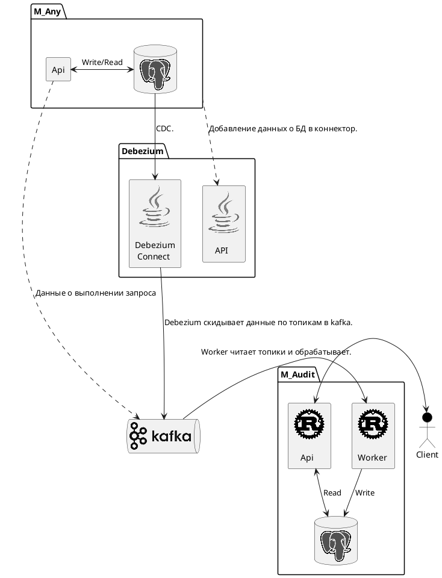

### Postgres (Клиент)
1. Запустите следующую команду SQL, чтобы изменить уровень WAL с реплики на логический и перезапустить вашу базу данных:
```SQL
    ALTER SYSTEM SET wal_level = logical;
```

__Обязательно нужно перезагрузить postgres!!!__

2. Создание публикации.
```SQL
-- Создайте ПУБЛИКАЦИЮ "audit", чтобы включить логическую репликацию для всех таблиц
CREATE PUBLICATION audit FOR ALL TABLES;

-- Создайте ПУБЛИКАЦИЮ "audit", чтобы включить логическую репликацию для выбранных таблиц
CREATE PUBLICATION audit FOR TABLE [table1], [table2];

-- Установите ПОЛНУЮ ИДЕНТИФИКАЦИЮ РЕПЛИКИ для таблиц, чтобы отслеживать состояние "до" изменений строк базы данных
ALTER TABLE [table1] REPLICA IDENTITY FULL;
ALTER TABLE [table2] REPLICA IDENTITY FULL;


-- Чтобы включить отслеживание изменений данных для новой таблицы:
ALTER PUBLICATION audit ADD TABLE [table3];
ALTER TABLE [table3] REPLICA IDENTITY FULL;

-- Чтобы остановить отслеживание изменений данных для таблицы:

ALTER PUBLICATION audit DROP TABLE [table3];
ALTER TABLE [table3] REPLICA IDENTITY DEFAULT;

```

3. Настройки для добавления в Debezium для отслеживания.
```JSON
{
    "name": ${name},
    "config": {
        "connector.class": "io.debezium.connector.postgresql.PostgresConnector",
        "tasks.max": "1",
        "database.hostname": ${hostname},
        "database.port": ${port} or "5432",
        "database.user": ${username},
        "database.password": ${password},
        "database.dbname": ${db_name},
        "topic.prefix": "audit",
        "plugin.name": "pgoutput",
        "table.exclude.list": "public.alembic_version,",
        "snapshot.mode": "never",
        "transforms": "Reroute",
        "transforms.Reroute.type": "org.apache.kafka.connect.transforms.RegexRouter",
        "transforms.Reroute.regex": "audit\\..*",
        "transforms.Reroute.replacement": "audit",
    },
}
```

